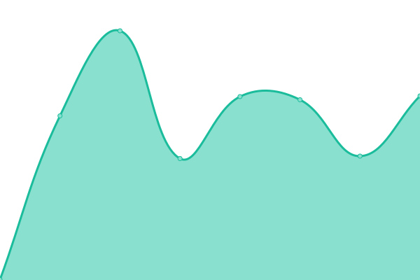
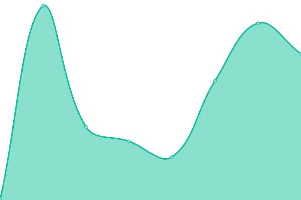
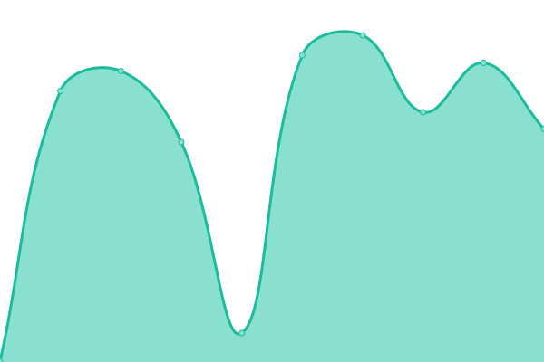
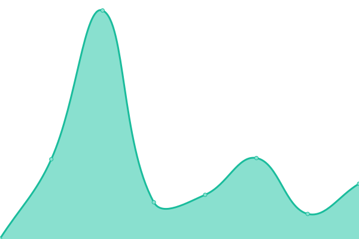
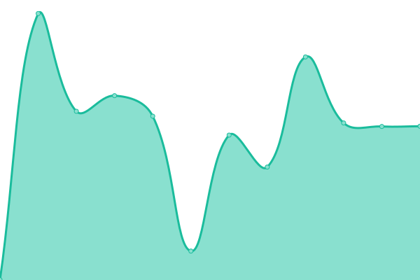
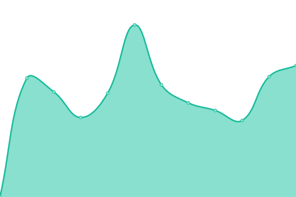
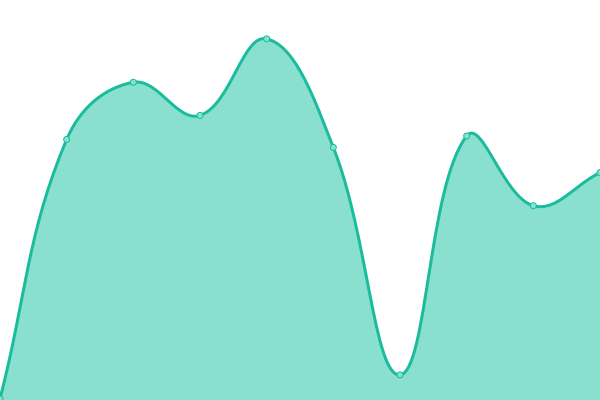
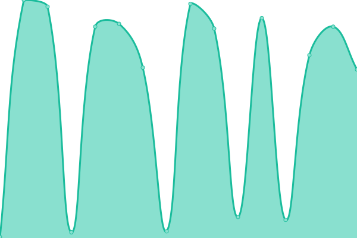

# [📈 Live Status](https://status.avianjay.sbs): <!--live status--> **🟧 Partial outage**

就只是一個用 [Upptime](https://github.com/upptime/upptime) 做的網站監控服務而已。

<!--start: status pages-->
<!-- This summary is generated by Upptime (https://github.com/upptime/upptime) -->
<!-- Do not edit this manually, your changes will be overwritten -->
<!-- prettier-ignore -->
| URL | Status | History | Response Time | Uptime |
| --- | ------ | ------- | ------------- | ------ |
|  [Main Website](https://avianjay.sbs) | 異常 | [main-website.yml](https://github.com/AvianJay/another-upptime/commits/HEAD/history/main-website.yml) | 

 505毫秒
     
 | 

<a href="https://status.avianjay.sbs/history/main-website">98.94%</a>
    

|  Raspberry PI | 異常 | [raspberry-pi.yml](https://github.com/AvianJay/another-upptime/commits/HEAD/history/raspberry-pi.yml) | 

 425毫秒
     
 | 

<a href="https://status.avianjay.sbs/history/raspberry-pi">98.95%</a>
    

|  [GCP-us-east](https://us.avianjay.sbs) | 正常 | [gcp-us-east.yml](https://github.com/AvianJay/another-upptime/commits/HEAD/history/gcp-us-east.yml) | 

 469毫秒
     
 | 

<a href="https://status.avianjay.sbs/history/gcp-us-east">100.00%</a>
    

|  [US East 2](https://ue2-proc.avianjay.sbs) | 正常 | [us-east-2.yml](https://github.com/AvianJay/another-upptime/commits/HEAD/history/us-east-2.yml) | 

 328毫秒
     
 | 

<a href="https://status.avianjay.sbs/history/us-east-2">100.00%</a>
    

|  [TW Server](https://tw-proc.avianjay.sbs/) | 正常 | [tw-server.yml](https://github.com/AvianJay/another-upptime/commits/HEAD/history/tw-server.yml) | 

 997毫秒
     
 | 

<a href="https://status.avianjay.sbs/history/tw-server">99.69%</a>
    

|  Bus API | 異常 | [bus-api.yml](https://github.com/AvianJay/another-upptime/commits/HEAD/history/bus-api.yml) | 

 568毫秒
     
 | 

<a href="https://status.avianjay.sbs/history/bus-api">99.38%</a>
    

|  [Discord Bot](https://yee.avianjay.sbs/) | 正常 | [discord-bot.yml](https://github.com/AvianJay/another-upptime/commits/HEAD/history/discord-bot.yml) | 

 171毫秒
     
 | 

<a href="https://status.avianjay.sbs/history/discord-bot">99.28%</a>
    

|  [Discord Bot (Test)](https://yeetest.avianjay.sbs/) | 正常 | [discord-bot-test.yml](https://github.com/AvianJay/another-upptime/commits/HEAD/history/discord-bot-test.yml) | 

 648毫秒
     
 | 

<a href="https://status.avianjay.sbs/history/discord-bot-test">99.38%</a>
    

|  [Self Flagger](https://ue2-proc.avianjay.sbs/selfflagger) | 正常 | [self-flagger.yml](https://github.com/AvianJay/another-upptime/commits/HEAD/history/self-flagger.yml) | 

 197毫秒
     
 | 

<a href="https://status.avianjay.sbs/history/self-flagger">100.00%</a>
    

|  [aniGamerPlus](https://agpp.avianjay.sbs) | 異常 | [ani-gamer-plus.yml](https://github.com/AvianJay/another-upptime/commits/HEAD/history/ani-gamer-plus.yml) | 

 671毫秒
     
 | 

<a href="https://status.avianjay.sbs/history/ani-gamer-plus">99.28%</a>
    

|  [OXWU](https://tw-proc.avianjay.sbs/oxwu) | 正常 | [oxwu.yml](https://github.com/AvianJay/another-upptime/commits/HEAD/history/oxwu.yml) | 

 663毫秒
     
 | 

<a href="https://status.avianjay.sbs/history/oxwu">99.69%</a>
    

|  [OXWU Reportd](https://tw-proc.avianjay.sbs/oxwu_reportd) | 正常 | [oxwu-reportd.yml](https://github.com/AvianJay/another-upptime/commits/HEAD/history/oxwu-reportd.yml) | 

 341毫秒
     
 | 

<a href="https://status.avianjay.sbs/history/oxwu-reportd">91.06%</a>
    

|  [ArchiSteamFarm](https://tw-proc.avianjay.sbs/asf) | 正常 | [archi-steam-farm.yml](https://github.com/AvianJay/another-upptime/commits/HEAD/history/archi-steam-farm.yml) | 

 354毫秒
     
 | 

<a href="https://status.avianjay.sbs/history/archi-steam-farm">99.69%</a>
    

|  [ArchiSteamFarm Bot](https://tw-proc.avianjay.sbs/asf_bot) | 正常 | [archi-steam-farm-bot.yml](https://github.com/AvianJay/another-upptime/commits/HEAD/history/archi-steam-farm-bot.yml) | 

 401毫秒
     
 | 

<a href="https://status.avianjay.sbs/history/archi-steam-farm-bot">100.00%</a>
    

|  [PaperMC Server](https://tw-proc.avianjay.sbs/paper) | 正常 | [paper-mc-server.yml](https://github.com/AvianJay/another-upptime/commits/HEAD/history/paper-mc-server.yml) | 

 292毫秒
     
 | 

<a href="https://status.avianjay.sbs/history/paper-mc-server">100.00%</a>
    

|  [GeyserMC Server](https://tw-proc.avianjay.sbs/geyser) | 正常 | [geyser-mc-server.yml](https://github.com/AvianJay/another-upptime/commits/HEAD/history/geyser-mc-server.yml) | 

 366毫秒
     
 | 

<a href="https://status.avianjay.sbs/history/geyser-mc-server">100.00%</a>
    

|  [BreakBlock Server](https://breakblock.avianjay.sbs) | 正常 | [break-block-server.yml](https://github.com/AvianJay/another-upptime/commits/HEAD/history/break-block-server.yml) | 

 680毫秒
     
 | 

<a href="https://status.avianjay.sbs/history/break-block-server">64.21%</a>
    

<!--end: status pages-->

[**去我網站看:D →**](https://status.avianjay.sbs)

## 📄 一些東西

- 使用 [Upptime](https://github.com/upptime/upptime)
- [MIT](./LICENSE) © [Anand Chowdhary](https://anandchowdhary.com) | [Pabio](https://pabio.com)
- `./history` 資料夾下的資料: [Open Database License](https://opendatacommons.org/licenses/odbl/1-0/)
